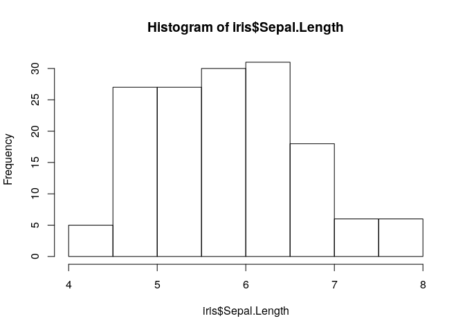
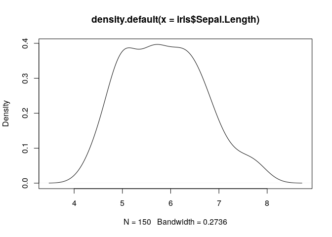
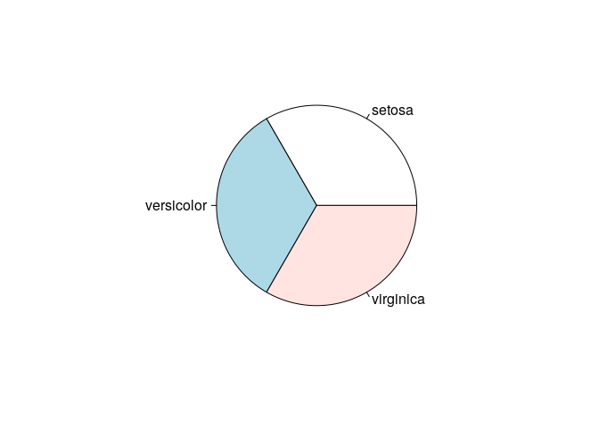
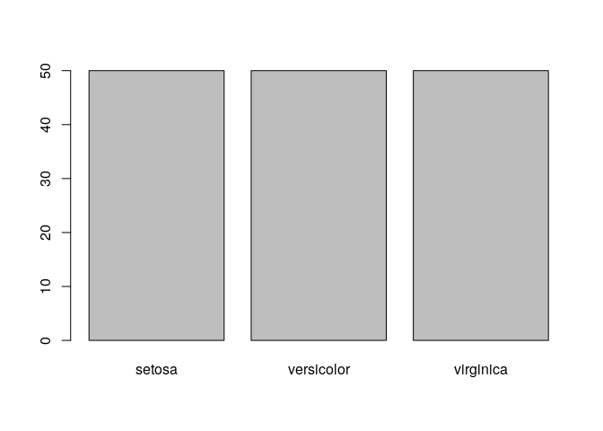

## Aprender R con iris

Iris es un conjunto de datos ampliamente conocido. Introducido por Fisher (1936), contiene 150 muestras de tres especies de flores (setosa, virginica y versicolor) y cuatro medidas para cada muestra, en centimetros: longitud y anchura del petalo y longitud y anchura del sepalo. 

## Un vistazo a los datos
Los datos de _iris_ se usan en este articulo para demostrar la exploracion de datos con R. En primer lugar verificamos el tamano y la estructura del conjunto de datos. La dimension y los nombres de los datos se obtienen respectivamente con las funciones *dim()* y *names()*. Las funciones *str()* y *attributes()* devuelven la estructura y los atributos de los datos.


```r
dim(iris)
```

```
## [1] 150   5
```

```r
names(iris)
```

```
## [1] "Sepal.Length" "Sepal.Width"  "Petal.Length" "Petal.Width" 
## [5] "Species"
```

```r
str(iris)
```

```
## 'data.frame':	150 obs. of  5 variables:
##  $ Sepal.Length: num  5.1 4.9 4.7 4.6 5 5.4 4.6 5 4.4 4.9 ...
##  $ Sepal.Width : num  3.5 3 3.2 3.1 3.6 3.9 3.4 3.4 2.9 3.1 ...
##  $ Petal.Length: num  1.4 1.4 1.3 1.5 1.4 1.7 1.4 1.5 1.4 1.5 ...
##  $ Petal.Width : num  0.2 0.2 0.2 0.2 0.2 0.4 0.3 0.2 0.2 0.1 ...
##  $ Species     : Factor w/ 3 levels "setosa","versicolor",..: 1 1 1 1 1 1 1 1 1 1 ...
```

```r
attributes(iris)
```

```
## $names
## [1] "Sepal.Length" "Sepal.Width"  "Petal.Length" "Petal.Width" 
## [5] "Species"     
## 
## $row.names
##   [1]   1   2   3   4   5   6   7   8   9  10  11  12  13  14  15  16  17
##  [18]  18  19  20  21  22  23  24  25  26  27  28  29  30  31  32  33  34
##  [35]  35  36  37  38  39  40  41  42  43  44  45  46  47  48  49  50  51
##  [52]  52  53  54  55  56  57  58  59  60  61  62  63  64  65  66  67  68
##  [69]  69  70  71  72  73  74  75  76  77  78  79  80  81  82  83  84  85
##  [86]  86  87  88  89  90  91  92  93  94  95  96  97  98  99 100 101 102
## [103] 103 104 105 106 107 108 109 110 111 112 113 114 115 116 117 118 119
## [120] 120 121 122 123 124 125 126 127 128 129 130 131 132 133 134 135 136
## [137] 137 138 139 140 141 142 143 144 145 146 147 148 149 150
## 
## $class
## [1] "data.frame"
```

Ahora, veamos las primeras cinco filas de los datos. las primeras o las ultimas filas del conjunto pueden ser mostradas con *head()* o *tail()*.


```r
iris[1:5,]
```

```
##   Sepal.Length Sepal.Width Petal.Length Petal.Width Species
## 1          5.1         3.5          1.4         0.2  setosa
## 2          4.9         3.0          1.4         0.2  setosa
## 3          4.7         3.2          1.3         0.2  setosa
## 4          4.6         3.1          1.5         0.2  setosa
## 5          5.0         3.6          1.4         0.2  setosa
```

```r
head(iris)
```

```
##   Sepal.Length Sepal.Width Petal.Length Petal.Width Species
## 1          5.1         3.5          1.4         0.2  setosa
## 2          4.9         3.0          1.4         0.2  setosa
## 3          4.7         3.2          1.3         0.2  setosa
## 4          4.6         3.1          1.5         0.2  setosa
## 5          5.0         3.6          1.4         0.2  setosa
## 6          5.4         3.9          1.7         0.4  setosa
```

```r
tail(iris)
```

```
##     Sepal.Length Sepal.Width Petal.Length Petal.Width   Species
## 145          6.7         3.3          5.7         2.5 virginica
## 146          6.7         3.0          5.2         2.3 virginica
## 147          6.3         2.5          5.0         1.9 virginica
## 148          6.5         3.0          5.2         2.0 virginica
## 149          6.2         3.4          5.4         2.3 virginica
## 150          5.9         3.0          5.1         1.8 virginica
```

Tambien podemos mostrar los valores de una sola columna. Por ejemplo, los 10 primeros valores de *Sepal.Length* pueden ser mostrados con cualquiera de los codigos siguientes:


```r
iris[1:10, "Sepal.Length"]
```

```
##  [1] 5.1 4.9 4.7 4.6 5.0 5.4 4.6 5.0 4.4 4.9
```

```r
iris$Sepal.Length[1:10]
```

```
##  [1] 5.1 4.9 4.7 4.6 5.0 5.4 4.6 5.0 4.4 4.9
```

## Explorar variables individuales

La distribucion de cada variable numerica puede ser verificada con la funcion *summary()*, que regresa los valores minimo, maximo, media, mediana y el primer (25%) y tercer (75%) cuartiles. Para factores (variables categoricas), muestra la frecuencia de cada nivel.


```r
summary(iris)
```

```
##   Sepal.Length    Sepal.Width     Petal.Length    Petal.Width   
##  Min.   :4.300   Min.   :2.000   Min.   :1.000   Min.   :0.100  
##  1st Qu.:5.100   1st Qu.:2.800   1st Qu.:1.600   1st Qu.:0.300  
##  Median :5.800   Median :3.000   Median :4.350   Median :1.300  
##  Mean   :5.843   Mean   :3.057   Mean   :3.758   Mean   :1.199  
##  3rd Qu.:6.400   3rd Qu.:3.300   3rd Qu.:5.100   3rd Qu.:1.800  
##  Max.   :7.900   Max.   :4.400   Max.   :6.900   Max.   :2.500  
##        Species  
##  setosa    :50  
##  versicolor:50  
##  virginica :50  
##                 
##                 
## 
```

La media, la mediana y el rango tambien pueden obtenerse con las funciones *mean()*, *median()*, y *range()* Los cuartiles y percentiles se obtienen con la funcion *quantile()* como se muestra:


```r
quantile(iris$Sepal.Length)
```

```
##   0%  25%  50%  75% 100% 
##  4.3  5.1  5.8  6.4  7.9
```

```r
quantile(iris$Sepal.Length, c(.1,.3,.65))
```

```
##  10%  30%  65% 
## 4.80 5.27 6.20
```

Ahora veamos la viarianza de *Sepal.Length* con *var()* y su diistribuicion mediante histograma y densidad usando las funciones *hist()* y *density()* (ver Figuras 1 y 2).


```r
var(iris$Sepal.Length)
```

```
## [1] 0.6856935
```

```r
hist(iris$Sepal.Length)
```

<!-- -->
**Figura 1.** Histograma

```r
plot(density(iris$Sepal.Length))
```

<!-- -->
**Figura 2.** Densidad

La frecuencia de los factores puede ser calculada con la funcion *table()* y luego graficada como tarta con *pie()* o grafica de barras con *barplot()* (ver Figuras 3 y 4).


```r
table(iris$Species)
```

```
## 
##     setosa versicolor  virginica 
##         50         50         50
```

```r
pie(table(iris$Species))
```

<!-- -->
**Figura 3.** Grafico de tarta

```r
barplot(table(iris$Species))
```

<!-- -->
**Figura 4.** Grafico de barras


